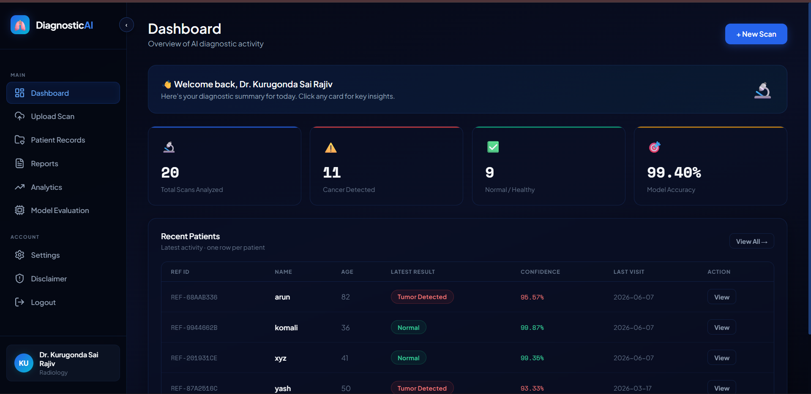
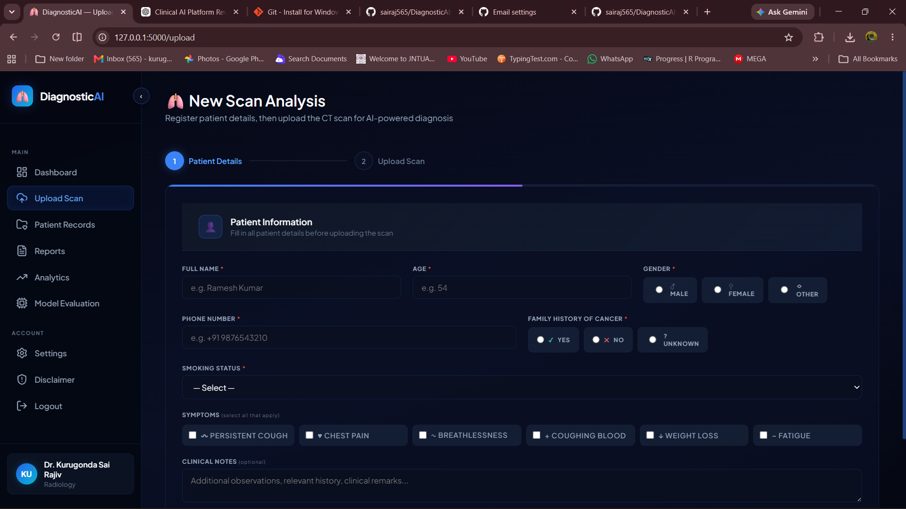
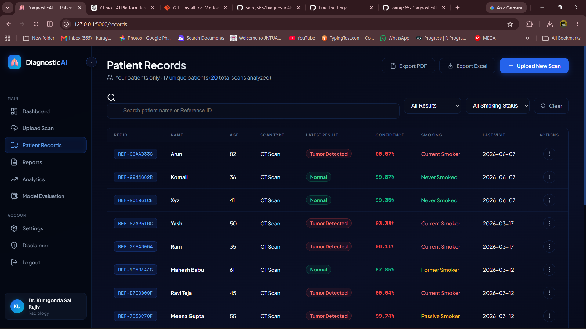
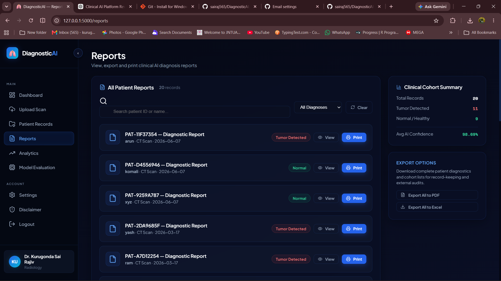
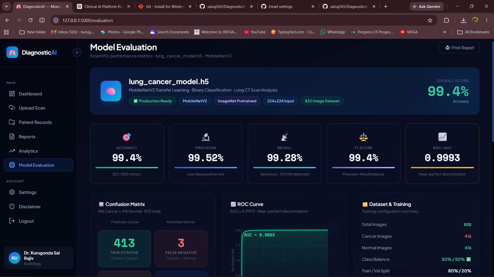
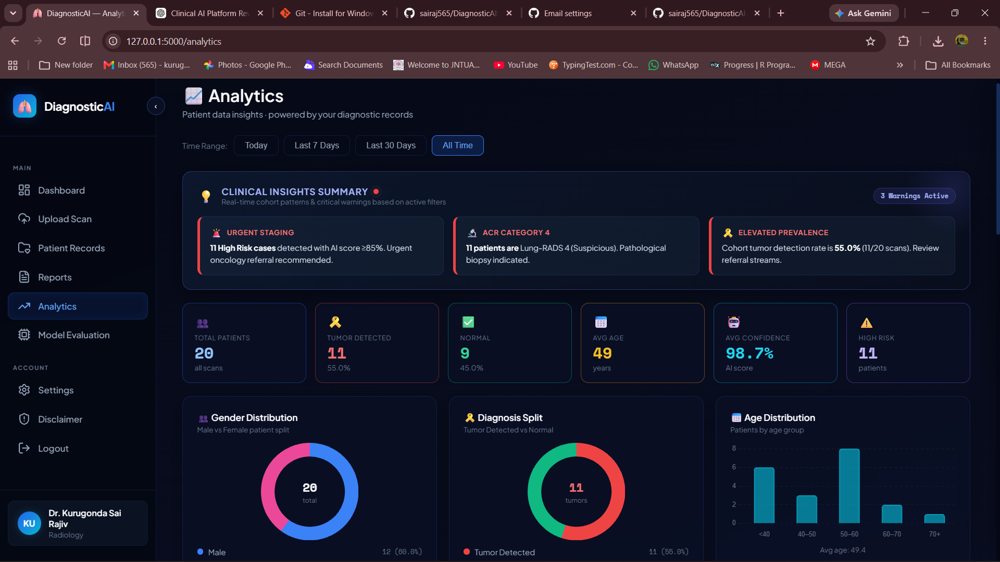

# 🫁 DiagnosticAI — Clinical AI Detection Platform

DiagnosticAI is a premium, fully-responsive clinical assistant web application designed to help radiologists, pulmonologists, and oncologists perform early detection and risk classification of lung cancer nodules from CT and MRI scans. 

Utilizing a deep learning MobileNetV2 model, the platform delivers instantaneous nodule analysis (<3 seconds) alongside automated **Lung-RADS clinical categorization**, risk assessment scoring, longitudinal patient record tracking, and print-ready report generation.

## ⚡ Quick Start

```bash
pip install -r requirements.txt
python app.py
```

---

## ✨ Features

- **🧠 Deep Learning Nodule Detection**: Local MobileNetV2-based image classification (`lung_cancer_model.h5`) integrated into a Flask clinical workflow prototype for lung nodule risk assessment.
- **📊 Lung-RADS Nodule Classification**: Automatically groups findings based on malignancy thresholds matching American College of Radiology guidelines (Lung-RADS 1, 2, 3, 4A, 4B).
- **📱 Native Mobile Rear-Camera Capture**: Built-in Progressive HTML5 Capture (`accept="image/*" capture="environment"`) that directly hooks into mobile back-facing cameras for rapid scan uploads on phones, while falling back gracefully to the file system explorer on desktop viewports.
- **🎨 Responsive Glassmorphic UX**: A premium dark-mode interface built on modern CSS typography, layout systems, and CSS variables. The entire dashboard, metrics panels, tables, and settings pages reflow to single-columns on viewports under 768px, including a mobile sticky header and a slide-in side drawer.
- **🔒 Secure Offline Workflow**: Bypasses external network dependencies and cloud APIs. Includes a secure offline Verification Challenge (locating the Lungs 🫁) to perform password resets without configuration of SMTP mail relays.
- **📋 Exportable Reports**: Export patient cohorts and individual clinical records directly to **Excel (.xlsx)** or print-ready **PDFs** containing clinician signature lines.

---

## 🛠️ Technology Stack

- **Backend**: Python Flask, Werkzeug Security (hashing)
- **Machine Learning**: TensorFlow (v2), Keras, OpenCV-python, NumPy
- **Database**: SQLite3 (relational database engine)
- **Frontend**: Semantic HTML5, Vanilla CSS3 (Custom Glassmorphic design tokens), Javascript (ES6), Lucide Icons
- **Document Exporting**: OpenPyXL (Excel generation), ReportLab (PDF compiler)

---

## 📁 Repository Structure

```text
DiagnosticAI/
├── app.py                     # Main Flask routing, auth sessions, and exports
├── model.py                   # OpenCV pre-processing & MobileNetV2 model predictions
├── lung_cancer_model.h5       # Pre-trained deep learning weights
├── requirements.txt           # Python dependency declarations
├── database/
│   └── db.py                  # SQLite3 database initializer and table schemas
├── static/
│   ├── css/
│   │   └── style.css          # Main glassmorphic theme styling & mobile overrides
│   ├── js/
│   │   └── main.js            # Sidebar toggle animations and modal controls
│   └── uploads/               # Secure local directory for uploaded patient scans
└── templates/                 # UI HTML templates (extended from base.html)
    ├── base.html              # Layout structure with responsive mobile header
    ├── dashboard.html         # Main overview stats and recent activity
    ├── upload.html            # Progressive wizard with mobile camera capture
    ├── records.html           # Master patient registry table
    ├── reports.html           # Report list, export actions, and print preview
    ├── evaluation.html        # AI model accuracy metrics, CM, and ROC chart
    └── settings.html          # Doctor specification profiles
```

---

## 🚀 Getting Started

### 1. Prerequisites
Make sure you have **Python 3.8 to 3.10** installed.

### 2. Install Dependencies
Clone the repository and install the libraries:
```bash
pip install -r requirements.txt
```

### 3. Environment Configuration
Create a `.env` file in the root folder of the project if you need customized email relays or custom session keys:
```env
SECRET_KEY=your_secure_development_key
```
*Note: The platform defaults to a fallback development key if `.env` is absent.*

### 4. Running the Application
Launch the Flask development server:
```bash
python app.py
```
Upon startup, the database is auto-initialized if it does not already exist.

Access the platform in your browser at:
👉 **`http://localhost:5000`**

---

## 🩺 Doctor Access & Test Instructions
1. Open the login page (`/login`) and click **Create New Account**.
2. Register a new physician profile (Name, Hospital, Medical License, Specialization).
3. Once logged in, navigate the clinical portal:
   - **Dashboard**: Review summary statistics. Tap on cards to load database insight reports.
   - **New Scan**: Enter mock patient symptoms (smoking habit, pack-years, symptoms) and upload a scan image (or use a mobile camera).
   - **Patient Records**: Look up files, filter results, and view medical profile histories.
   - **Reports**: Generate and print clean, clinical diagnostic sheets.
   - **Model Evaluation**: Review the Confusion Matrix and ROC curve.

---

## 🔬 AI Inference Pipeline & Clinical Disclaimer

### 1. Nodule Prediction Pipeline
The diagnostic predictions are generated live by the TensorFlow model through the following pipeline:
- **Preprocessing**: Uploaded images are read using OpenCV, converted from BGR to RGB space, resized to `224×224` pixels, and normalized (`pixel / 255.0`) to match the network input structure.
- **Model Inference**: The system loads `lung_cancer_model.h5` and feeds it the processed input array to obtain a probability score (`raw_pred`).
- **Clinical Mapping**: If `raw_pred <= 0.5`, the scan is classified as **Tumor Detected**, mapping the confidence level to a corresponding **Lung-RADS Category (3, 4A, or 4B)**. Otherwise, it is classified as **Normal**, mapping to **Lung-RADS Category (1 or 2)**.

### ⚠️ Medical Disclaimer
> [!WARNING]
> **DiagnosticAI is designed to act as an assistant tool for radiologists and clinical researchers.** 
> While the MobileNetV2 deep learning model runs live math-based predictions, these results are intended for auxiliary diagnostic support, educational reference, and workflow triaging. They do not constitute final medical diagnoses. All clinical decisions and follow-up protocols must be verified by a certified healthcare professional.

## Screenshots

### Dashboard


### Upload Scan


### Patient Records


### Reports


### Model Evaluation


### Analytics

